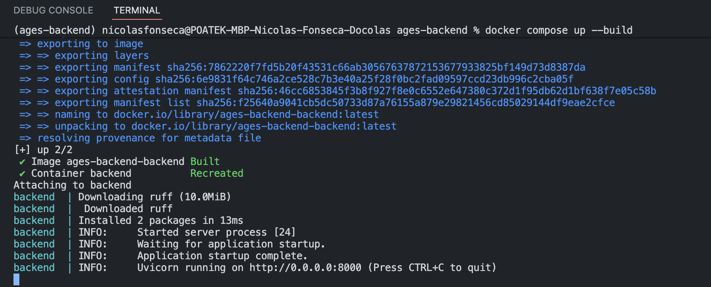
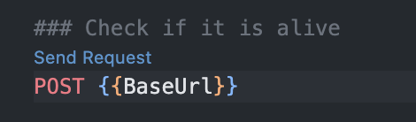
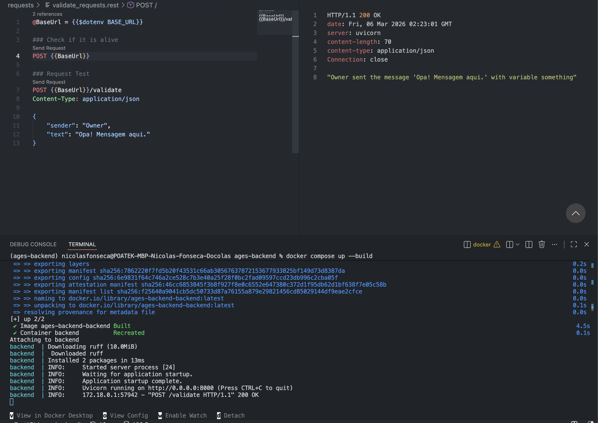

Project Setup

1. Install Dependencies

- Windows:

    Python 3.12.13:

    ```bash
    winget install Python.Python.3.12
    ```

    Docker:

    ```bash
    winget install -e --id Docker.DockerDesktop
    ```

    Docker Compose Installed automatically with Docker Desktop.

------------------------------------------------------------------------

- macOS:

    Python 3.12.13:

    ```bash
    brew install python@3.12
    ```

    Docker:

    ```bash
    brew install --cask docker-desktop
    ```

    Docker Compose Installed automatically with Docker Desktop.

    If you do not have Homebrew installed, run:

    ```bash
    /bin/bash -c "$(curl -fsSL https://raw.githubusercontent.com/Homebrew/install/HEAD/install.sh)"
    ```

------------------------------------------------------------------------

- Linux (Ubuntu/Debian):

    Python 3.12.13:

    ```bash
    sudo apt update
    sudo apt install -y python3.12 python3.12-venv python3.12-dev
    ```

    Docker:

    ```bash
    sudo apt update
    sudo apt install -y docker.io
    ```

    Docker Compose:

    ```bash
    sudo apt install -y docker-compose-plugin
    ```

------------------------------------------------------------------------

2. Environment Variables

    Create a file named:

        .env

    Copy the contents from:

        .env-example

    This file will contain the project’s private environment variables.

------------------------------------------------------------------------

3. VSCode Extensions

    Install the following extensions:

    -   Ruff
    -   REST Client

------------------------------------------------------------------------

4. Run the Application

    After completing steps 1 and 2, run:

    1. Docker:
            `docker compose up --build`
        
        If everything is working fine, you should see this:

        

        To verify that everything is working, open: `requests/validate_request.rest`

        Then click `“Send Request”`.

        Example:

        

        If everything works, you should see this:

        `

    2. VSCode:

        In order to debbug your code, you must run the application via VSCode. Simply click "F5" and the application will start.