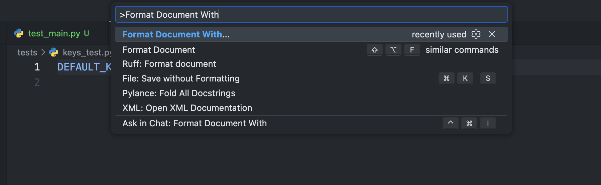

Project Setup Startup

1. Install Dependencies

- Windows:

    Python 3.12.13:

    ```bash
    winget install Python.Python.3.12
    ```

    Docker:

    ```bash
    winget install -e --id Docker.DockerDesktop
    ```

    Docker Compose Installed automatically with Docker Desktop.

------------------------------------------------------------------------

- macOS:

    Python 3.12.13:

    ```bash
    brew install python@3.12
    ```

    Docker:

    ```bash
    brew install --cask docker-desktop
    ```

    Docker Compose Installed automatically with Docker Desktop.

    If you do not have Homebrew installed, run:

    ```bash
    /bin/bash -c "$(curl -fsSL https://raw.githubusercontent.com/Homebrew/install/HEAD/install.sh)"
    ```

------------------------------------------------------------------------

- Linux (Ubuntu/Debian):

    Python 3.12.13:

    ```bash
    sudo apt update
    sudo apt install -y python3.12 python3.12-venv python3.12-dev
    ```

    Docker:

    ```bash
    sudo apt update
    sudo apt install -y docker.io
    ```

    Docker Compose:

    ```bash
    sudo apt install -y docker-compose-plugin
    ```

------------------------------------------------------------------------

2. Environment Variables

    Create a file named:

        .env

    Copy the contents from:

        .env-example

    This file will contain the project’s private environment variables.

------------------------------------------------------------------------

3. VSCode Extensions

    Install the following extensions:

    -   Ruff
    -   REST Client

    After installing Ruff, follow this steps:

    1. Open any python file
    2. Type "Control + Shift + P" (in MacOS Command + Shift + P)
    3. In the text box type: "Format Document With":
        
    4. Select Ruff

------------------------------------------------------------------------

4. Run the Application

    After completing steps 1 and 2, run:

    1. VSCode:

        1. Go to the backend folder path in your terminal: (cd path)
        2. Run the following commands:
            ```bash
            curl -LsSf https://astral.sh/uv/install.sh | sh
            ```
            Validate that UV is installed, perhaps a restart is needed.
            ```bash
            uv sync
            ```

            Then click "F5" to run.

    2. Docker:
        ```bash
        docker compose up --build
        ```
        
    3. If everything works fine, you should see this:

        

    4. Test:

        1. Open: `requests/validate_request.rest`

        2. Click `“Send Request”`.

            Example:

            

            If everything works, you should see this:

            `

dnkan